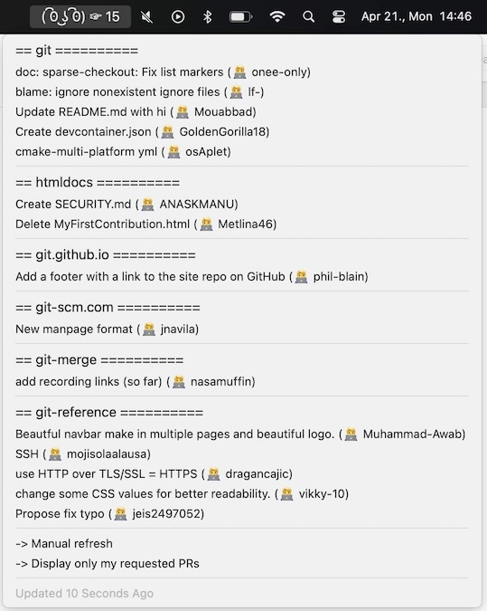

# github PR checker swiftbar plugin

### About the Script

The `gh-prs.1h.sh` script is a SwiftBar plugin that displays open pull requests (PRs) for all repositories in a GitHub organization. It uses the GitHub CLI (`gh`) and `jq` to fetch and format PR data. The script supports filtering PRs by those specifically requesting your review or showing all open PRs. It also provides links to the PRs and repositories directly in the SwiftBar menu.

Key features:
- Displays the number of open PRs.
- Shows detailed information about each PR.
- You can find the title and the author and when the PR got enough approves you can see a tick after the title.
- In the dropdown, when the option key (⌥) is pressed, it shows the age and the requested reviewers.
- Click on the item opens the PR page in your browser.
- Allows toggling between "all PRs" and "requested PRs" views.
- Provides manual refresh and error handling for missing dependencies or configuration.

 

### How to use

  * Just copy the plugin shell script into your swiftbar plugins folder 
  * Then choose `Refresh all` from the swiftbar menu

### Dependecies

https://github.com/swiftbar/SwiftBar
`brew install swiftbar`

https://jqlang.org/
`brew install jq`

https://cli.github.com/manual/
`brew install gh`
`gh auth login`

and you need an environment variable with your github org name:
`GITHUB_OWNER=owner`

### Configuration

1. Ensure the required dependencies (`gh`, `jq`) are installed.
2. Authenticate with GitHub using `gh auth login`.
3. Set the `GITHUB_OWNER` environment variable to your GitHub organization name.
4. Place the script in your SwiftBar plugins folder.
5. On the first run, the script creates a configuration file in `~/.config` folder with the default filter for PRs.

Enjoy tracking your GitHub PRs effortlessly!
